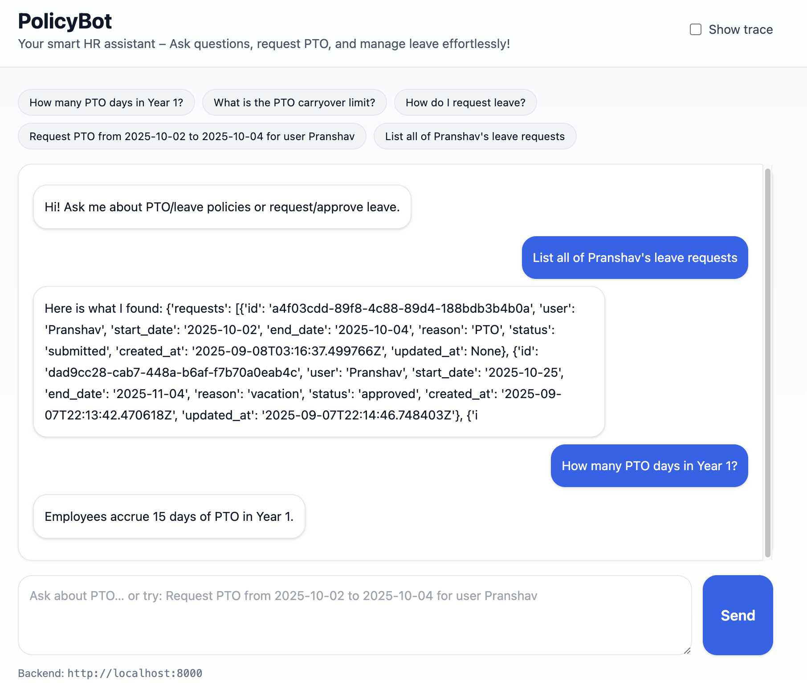
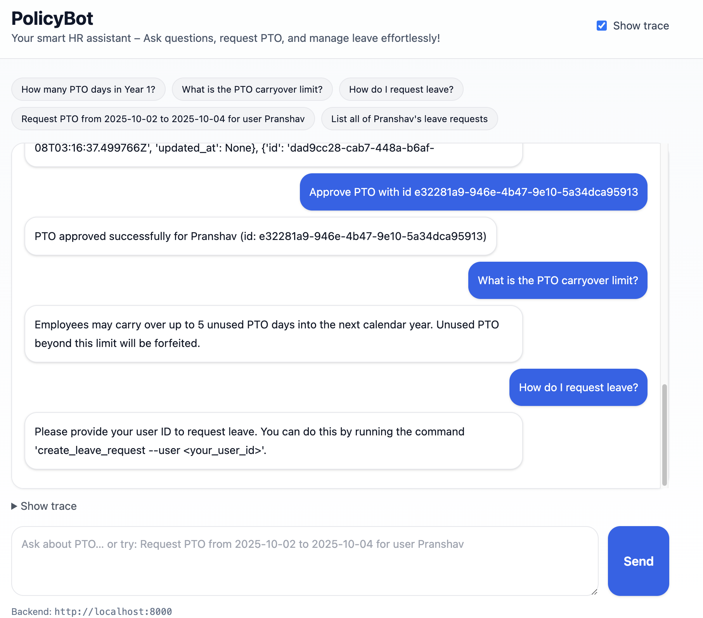

# PolicyBot – HR Policy Q&A + Leave Management

PolicyBot is an AI-powered HR assistant that answers questions about PTO/leave policies and helps manage leave requests.  
It integrates:
- **FastAPI backend** for agent logic and APIs
- **React + Tailwind frontend** for a chat UI
- **Slack integration** for workplace deployment
- **RAG pipeline** with ChromaDB and HuggingFace embeddings for accurate HR policy answers
- **Docker Compose** setup for containerized deployment

---

## Features
- Ask HR policy questions (e.g., PTO days, carryover limits, leave accrual rules).
- Submit, approve, and cancel leave requests.
- Interactive **chat UI** with pre-defined prompt buttons.
- Slack integration via Events API.
- RAG-based retrieval for accurate answers with citations.

---

## Project Structure
```
trial_project/
│── agent/             # ReAct agent logic and tools
│── api/               # FastAPI app (entrypoint for backend)
│── db/                # Database setup (leave requests, user info)
│── frontend/          # React + Tailwind frontend (chat UI)
│── rag/               # Retrieval-Augmented Generation (vectorstore, embeddings)
│── scripts/           # Helper scripts for local queries & eval
│── slack/             # Slack integration (events + commands)
│── tools/             # Shared utilities (QA chain, retriever, etc.)
│── vectorstore/       # Local ChromaDB persistence
│── .env               # Environment variables
│── config.py          # Config for API keys and settings
│── docker-compose.yml # Multi-container setup (API + frontend + DB)
│── Dockerfile         # API service Dockerfile
│── requirements.txt   # Python dependencies
│── README.md          # Project documentation
```

---

## ⚙️ Setup

### 1. Clone Repository
```bash
git clone <repo-url>
cd trial_project
```

### 2. Python Backend Setup
```bash
python -m venv .venv
source .venv/bin/activate   # macOS/Linux
.venv\Scripts\activate    # Windows

pip install -r requirements.txt
```

Run the FastAPI server:
```bash
uvicorn api.app:app --reload --port 8000
```

### 3. Frontend Setup
```bash
cd frontend
npm install
npm run dev
```

The chat UI runs on: `http://localhost:5173`

### 4. Run with Docker
```bash
docker compose up --build
```

### 5. Slack Integration
- Create a Slack App → Add **Event Subscriptions**
- Set Request URL to your **ngrok tunnel** (e.g., `https://xxxx.ngrok-free.app/slack/events`)
- Backend must handle Slack **challenge** verification.

---

## 🧪 Example Queries
- *How many PTO days in Year 1?*
- *What is the PTO carryover limit?*
- *Do I accrue PTO during unpaid leave?*
- *Request PTO from 2025-10-02 to 2025-10-04 for Pranshav*
- *List all of Pranshav's leave requests*

## Demo



---

## ✅ Current Status
- Backend (FastAPI) ✅
- Frontend (React UI) ✅
- Slack Integration ✅
- RAG Evaluation ✅
- Dockerized Deployment ✅

This project is now **feature complete** 🎉

---

## 👨‍💻 Author
Pranshav Patel  
North Carolina State University  
Master’s in Computer Science 
