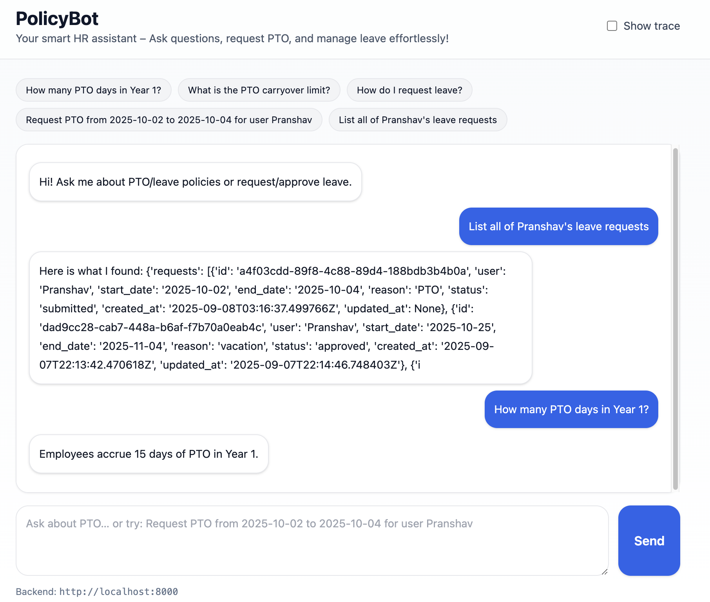
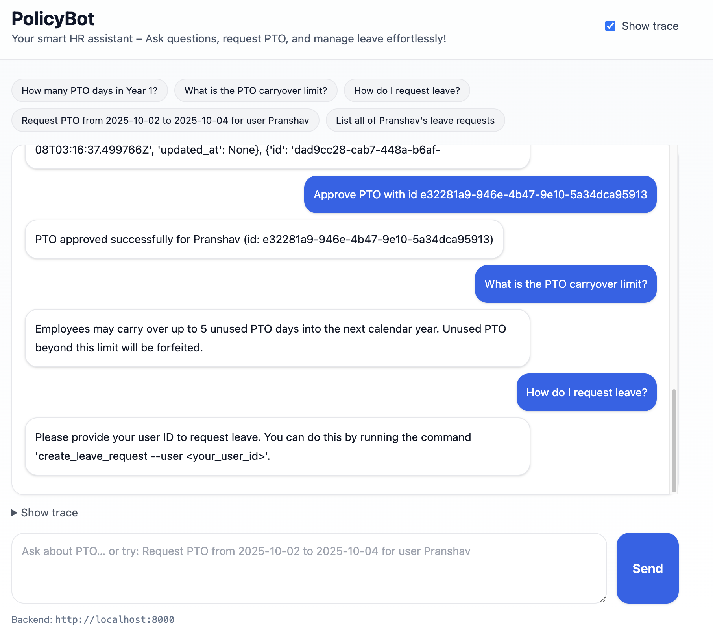

# PolicyBot – HR Policy Q&A + Leave Management

[](https://github.com/pranshavpatel/policyBot/actions/workflows/ci.yml)

PolicyBot is an HR assistant that answers policy questions over a RAG pipeline and manages leave requests through a ReAct-style chat agent and a REST API, both behind JWT auth with role-based access control and an audit trail.

- **FastAPI backend**, JWT auth + RBAC, structured JSON logging
- **Hybrid (BM25 + dense) retrieval** over 6 HR/IT policy docs, with a lexical groundedness guardrail on generated answers
- **ReAct-style chat agent** (Groq / Llama) that can also create/approve/reject/cancel leave requests as tool calls
- **React + Tailwind frontend** for the chat UI
- **Slack integration** via the Events API
- **45-test pytest suite + GitHub Actions CI**

---

## Architecture

```
                     ┌─────────────┐
  React UI  ───────▶ │  FastAPI    │ ◀─── Slack Events API
  (frontend/)        │  api/app.py │
                     └──────┬──────┘
                            │  JWT (auth/)  →  RBAC (auth/authz.py)  →  audit log (auth/audit.py)
                ┌───────────┼────────────────┐
                ▼                            ▼
        tools/qa_chain.py            agent/react_agent.py  (ReAct loop)
        (RAG: retrieve→prompt→LLM)          │
                │                     agent/tools.py (create/approve/reject/
                ▼                     cancel leave, doc_search, holidays…)
        rag/retrieval.py                    │
        (dense | hybrid, config.py)         ▼
                │                     tools/leave_request.py → db/ (SQLite)
                ▼
        rag/groundedness.py (numeric/date claims checked against context)
```

Every write path — direct REST call *or* chat-agent tool call — goes through the same `auth/authz.py` rules and writes to the same audit log; see [Auth & authorization](#auth--authorization).

---

## Setup

### 1. Clone & install
```bash
git clone https://github.com/pranshavpatel/policyBot.git
cd policyBot
python -m venv .venv && source .venv/bin/activate   # .venv\Scripts\activate on Windows
pip install -r requirements.txt
cp .env.example .env   # fill in GROQ_API_KEY at minimum
```

### 2. Initialize the database and build the vectorstore
```bash
python -m scripts.db_init          # creates data/policybot.db (leave_requests, audit_log)
python -m scripts.ingest_langchain # chunks data/policies/*.md into Chroma (local embeddings, no API key needed)
```

### 3. Run the API
```bash
uvicorn api.app:app --reload --port 8000
```

### 4. Run the frontend
```bash
cd frontend && npm install && npm run dev   # http://localhost:5173
```

### 5. Docker
```bash
docker compose up --build
```

### 6. Slack (optional)
Create a Slack App → Event Subscriptions → point the Request URL at `https://<your-tunnel>/slack/events`.

---

## Auth & authorization

Every leave-request and chat/agent endpoint requires a bearer token. Three seeded demo users (see `auth/users.py`):

| username | password | role |
|---|---|---|
| `alice` | `alice123` | employee |
| `bob` | `bob123` | employee |
| `manager1` | `manager123` | manager |

```bash
TOKEN=$(curl -s -X POST localhost:8000/auth/login -d "username=alice&password=alice123" | jq -r .access_token)
curl -H "Authorization: Bearer $TOKEN" localhost:8000/leave-requests
```

Rules, centralized in `auth/authz.py` and enforced identically by the REST API (`api/app.py`) **and** the chat agent (`agent/tools.py`, so "ask the bot to approve my own leave" is rejected the same way a direct API call is):

- An employee can only create, view, and cancel **their own** leave requests — `?user=someone-else` is silently ignored and scoped back to the caller.
- Only a **manager** can approve/reject, and never their own request.
- Every login/create/approve/reject/cancel is written to an append-only audit log, readable at `GET /audit-log` (manager-only).

This was verified end-to-end against a live server, not just unit-tested — see the commit history for the full request/response trace (login → create → self-approve-rejected-403 → manager-approves → manager-self-approve-rejected-403 → scoped-list → audit-log-403-then-200).

---

## Retrieval quality: dense, hybrid, and cross-encoder reranking

`RETRIEVAL_MODE=dense|hybrid` in `.env` toggles between pure embedding search and BM25+dense fused with Reciprocal Rank Fusion (`rag/hybrid_retriever.py`); `RERANK_ENABLED=true` adds a cross-encoder reranking stage on top of whichever mode is active (`rag/reranker.py`) — a second-stage model that scores each (query, chunk) *pair* jointly, instead of comparing independently-computed embeddings, at the cost of one forward pass per candidate instead of a single batched similarity lookup. `scripts/eval_retrieval.py` reports standard IR ranking metrics — Recall@k, Precision@k, and MRR — not just a binary hit-rate; see the script's docstring for why those three and not NDCG. Measure it yourself:

```bash
python -m scripts.ingest_langchain
python -m scripts.eval_retrieval eval/qa.jsonl --k 1 --k 3 --k 5 --rerank --show-misses
```

Measured on this repo's actual corpus (6 docs / 21 chunks, 42 source-labeled questions in `eval/qa.jsonl`):

| Mode | MRR | Recall@1 | Precision@1 | Recall@3 | Precision@3 | Recall@5 | Precision@5 |
|---|---|---|---|---|---|---|---|
| Dense | 1.0 | 100% | 100% | 100% | 33.3% | 100% | 20.0% |
| Hybrid | 1.0 | 100% | 100% | 100% | 33.3% | 100% | 20.0% |

**Honest reading:** MRR=1.0 for both means the correct doc isn't just *somewhere* in the top-k, it's ranked #1 every single time — this corpus doesn't discriminate the two retrievers even on ranking quality, not just presence. That's an expected result of a 21-chunk corpus where each policy topic maps almost 1:1 to a single source document, not a null finding for hybrid: the value of lexical (BM25) retrieval shows up on **exact-term queries** — bare acronyms, policy numbers, IDs — where embedding similarity can be inconsistent even when it isn't here. `eval/qa.jsonl` includes bare acronym queries (`FMLA`, `MDM`) specifically to probe this; both retrievers currently handle them correctly on this small corpus, but hybrid is the one with a mechanism (exact lexical match) guaranteeing it rather than a happy accident of the corpus being small and clean. At a larger scale, or with more topically-overlapping documents, expect dense-only to show a real gap — and Precision@k dropping as k grows (33.3% at k=3, 20% at k=5) is the metric actually earning its keep here: it's mechanically expected with one relevant doc per query, and it's what would catch a retriever that pads out top-k with irrelevant chunks on a real, larger corpus where Recall@k alone can't see that cost.

One real bug the hybrid path surfaced along the way: `BM25Retriever`'s default tokenizer is plain `str.split()` — no lowercasing, no punctuation stripping — so a query for `FMLA` never matched `(FMLA).` in the corpus. Fixed with a proper word-boundary tokenizer (`rag/hybrid_retriever.py::_tokenize`); regression-tested in `tests/test_retrieval.py`.

**Reranking**, measured the same way (`--rerank`, `cross-encoder/ms-marco-MiniLM-L-6-v2`):

| Mode | MRR | Added latency/query (steady-state) |
|---|---|---|
| Dense | 1.0 | — |
| Hybrid | 1.0 | — |
| Dense + rerank | 1.0 | +29ms |
| Hybrid + rerank | 1.0 | +23ms |

No accuracy change here either — same root cause as dense vs. hybrid above, this corpus is too small and too cleanly separated to need a second-stage reranker to pick the right document out of a crowded field. The real cost is real, though: reranking adds a genuine ~25-30ms/query on top of a first-stage retriever that was already under 20ms, because it's a forward pass per candidate rather than a single similarity lookup — small on 10-15 candidates, but it's the number that would matter at a larger `RERANK_CANDIDATES` or on a slower CPU. There's also a one-time ~1s model-load-and-warmup cost per process (`RerankingRetriever`'s first call downloads/loads the ~90MB cross-encoder and pays an extra slow first inference on top of that) — `scripts/eval_retrieval.py --rerank` warms the model before timing anything, the same way you'd warm it before serving real traffic, so the numbers above are steady-state, not skewed by that one-time cost.

Where reranking *would* earn its keep here, even without moving the doc-level metrics above: `leave_policy.md` alone splits into 14 chunks, and Recall/Precision/MRR only check whether the right *document* was retrieved, not whether the single best-matching *chunk within* it was ranked first — a real chunk-level signal this eval set doesn't currently label (it has one relevant doc per question, not one relevant chunk). That's the honest gap: on a corpus with less topic-to-document overlap, or with chunk-level relevance labels, this comparison would likely look different, and the reranker exists in this repo now specifically so that measurement is one `--rerank` flag away instead of a rewrite.

---

## Groundedness guardrail

`rag/groundedness.py` extracts numeric/date tokens from a generated answer and checks each one actually appears in the retrieved context, before the answer is returned. This catches the most common and most costly failure mode for a policy bot — a confidently wrong number (wrong PTO day count, wrong dollar amount) — for zero extra LLM calls and zero extra latency.

```python
>>> check_groundedness("You get 25 sick days.", "Employees receive 10 paid sick days annually.")
GroundednessResult(grounded=False, coverage=0.0, unsupported_claims=['25'])
```

When an answer fails the check, it's swapped for an explicit low-confidence fallback rather than shown to the user. Unit-tested in `tests/test_groundedness.py`.

---

## End-to-end answer-quality eval

`scripts/eval_via_api.py` logs in, then runs `eval/qa.jsonl` against a live `/agent` endpoint and checks `must_contain`/`must_not` on the final answer — this is the one eval that needs a real `GROQ_API_KEY` (it makes live LLM calls), so it isn't part of CI:

```bash
uvicorn api.app:app --port 8000 &
python -m scripts.eval_via_api eval/qa.jsonl
```

**Result on a real run (`openai/gpt-oss-20b` on Groq): 40/45 = 88.9%.**

Two things surfaced only by actually running this against a live model, both worth being explicit about rather than smoothing over:

- **A real eval-harness bug**: the raw run scored 38/45. Two "failures" — `"By when must carried-over PTO be used?"` and the Day-1 benefits question — had visibly correct answers (`"...used by June 30..."`, `"...begin on Day 1..."`) that the naive `must_contain` substring check still missed, because the model renders some numbers with a narrow no-break space (`U+202F`, e.g. `"June 30"`) instead of an ASCII space. Fixed by NFKC-normalizing both sides before comparing (`scripts/eval_via_api.py::_norm`); re-verified against the exact captured answers rather than re-spending API calls on a second full run. That's the 38→40 delta.
- **A real hallucination**, still present: asked *"Who do I contact if my VPN reset still isn't working?"*, the agent answered *"contact the IT Help Desk... helpdesk@company.com or call extension 1234"* — a phone extension and email address invented wholesale; the actual policy (`vpn_reset.md`) says to contact `#it-support`. The likely cause: the ReAct planner sometimes emits `{"action":"final",...}` directly after a tool call instead of routing the final answer back through `tools/qa_chain.py`'s groundedness check (`agent/react_agent.py`'s `outcome: "final_no_tool"` in the logs) — so an answer can reach the user without ever passing through `rag/groundedness.py`. That's a real architectural gap, not a rare fluke, and the honest next fix (not done here — it changes agent control flow, not a config value): route every `final` action's answer through `check_groundedness()` before returning it, not just the direct `rag_answer` tool path.
- **Two more "failures"** (a stock-ticker question got a fabricated `"XYZ"`; a dress-code question and a CEO-salary question were both correctly refused, just phrased differently than the exact string the harness checked for) split roughly one real miss, one strict-match harness artifact — included in the raw count above rather than argued away.
- **Latency was high**: most answers took 15–40+ seconds. Partly this model's serving latency on Groq, partly the ReAct loop re-planning 2–3 steps per question when one `rag_answer` call would do — visible directly in the structured logs (`agent_run` `steps` field). Worth profiling before this goes anywhere near a real Slack channel.

---

## Observability

`observability.py` emits one structured JSON line per HTTP request (method, path, status, latency, request id) and per agent step (LLM call latency + token usage where the model reports it, tool-call latency, per-run summary). Sample, captured from a real run:

```json
{"ts": "2026-09-22T18:42:37", "level": "INFO", "logger": "policybot.http", "message": "request", "request_id": "293b5c34", "method": "POST", "path": "/auth/login", "status_code": 200, "latency_ms": 176.9}
```

---

## Testing

```bash
pytest              # 45 tests: leave-request logic, holiday logic, authz rules,
                     # groundedness, actor-scoped agent tools, full API RBAC flows,
                     # retrieval correctness (skipped if the vectorstore isn't built)
```

CI (`.github/workflows/ci.yml`) builds the vectorstore with local embeddings (no secret required — `GROQ_API_KEY` only needs to be *present*, since `ChatGroq`'s constructor validates that and nothing in the suite calls `.invoke()`), runs the suite, and separately lints + builds the frontend.

---

## Project structure
```
policyBot/
├── agent/        # ReAct planning loop (react_agent.py) + actor-scoped tools (tools.py)
├── api/          # FastAPI app: auth, leave requests, holidays, chat/agent, audit log
├── auth/         # JWT, seeded users, RBAC rules, audit log
├── db/           # SQLAlchemy models + session (SQLite)
├── frontend/     # React + Tailwind chat UI
├── observability.py
├── rag/          # splitter, embeddings, dense + hybrid retrieval, groundedness
├── scripts/      # ingest, db_init, eval_retrieval, eval_via_api
├── slack/        # Slack Events API integration
├── tools/        # doc_search, qa_chain, leave_request, holiday_check
├── tests/        # pytest suite
└── eval/qa.jsonl # labeled Q&A set used by both eval scripts
```

## Example queries
- *How many PTO days in Year 1?*
- *What is the PTO carryover limit?*
- *Do I accrue PTO during unpaid leave?*
- *Request PTO from 2025-10-02 to 2025-10-04*
- *List my leave requests*

## Demo



---

## Author
Pranshav Patel
North Carolina State University
Master's in Computer Science
