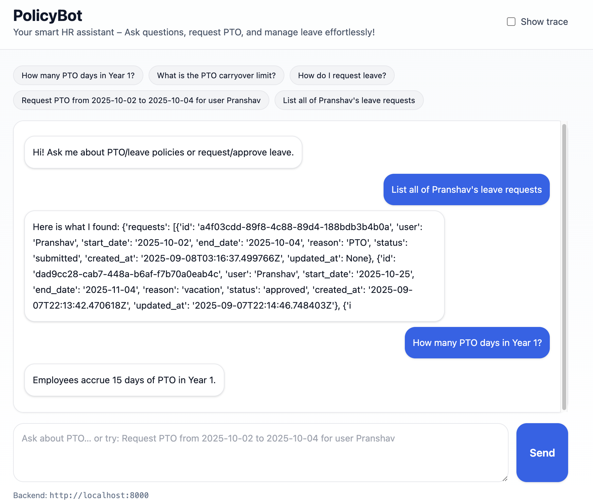
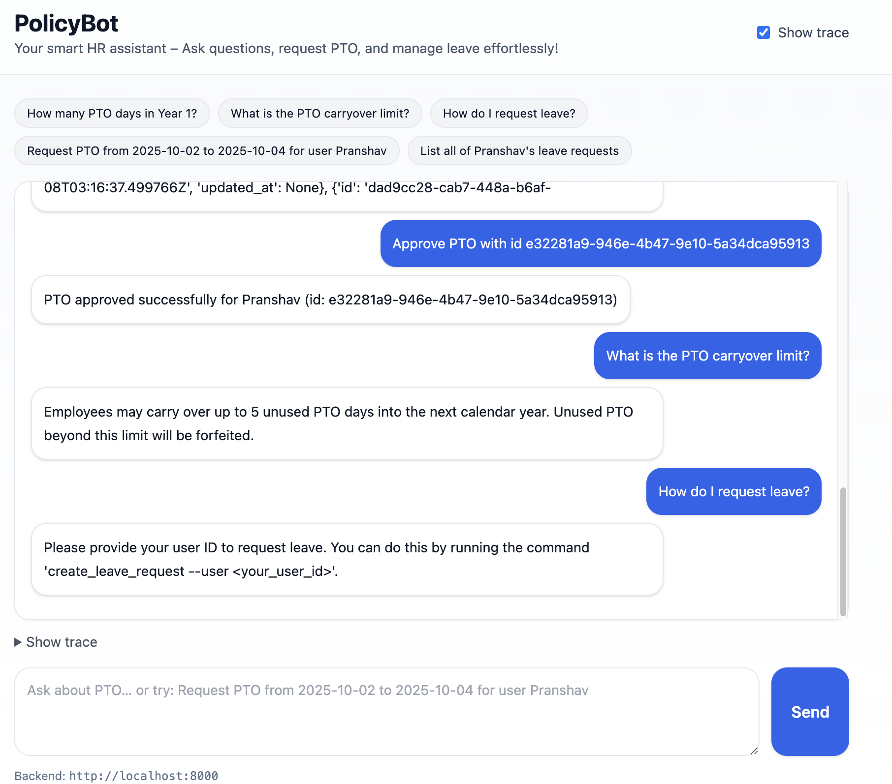

# PolicyBot – HR Policy Q&A + Leave Management

[](https://github.com/pranshavpatel/policyBot/actions/workflows/ci.yml)

PolicyBot is an HR assistant that answers policy questions over a RAG pipeline and manages leave requests through a ReAct-style chat agent and a REST API, both behind JWT auth with role-based access control and an audit trail.

- **FastAPI backend**, JWT auth + RBAC, structured JSON logging
- **Hybrid (BM25 + dense) retrieval + cross-encoder reranking** over 26 HR/IT policy docs, with a lexical groundedness guardrail on generated answers
- **ReAct-style chat agent**, LLM provider swappable between Groq (hosted) and any local OpenAI-compatible server (Ollama, vLLM) — 90.0% end-to-end accuracy measured on real GPU hardware (`qwen3:32b`, RTX 6000 Ada) — that can also create/approve/reject/cancel leave requests as tool calls
- **React + Tailwind frontend** for the chat UI
- **Slack integration** via the Events API
- **90-test pytest suite + GitHub Actions CI**

---

## Architecture

```
                     ┌─────────────┐
  React UI  ───────▶ │  FastAPI    │ ◀─── Slack Events API
  (frontend/)        │  api/app.py │
                     └──────┬──────┘
                            │  JWT (auth/)  →  RBAC (auth/authz.py)  →  audit log (auth/audit.py)
                ┌───────────┼────────────────┐
                ▼                            ▼
        tools/qa_chain.py            agent/react_agent.py  (ReAct loop)
        (RAG: retrieve→prompt→LLM)          │
                │                     agent/tools.py (create/approve/reject/
                ▼                     cancel leave, doc_search, holidays…)
        rag/retrieval.py                    │
        (dense | hybrid, config.py)         ▼
                │                     tools/leave_request.py → db/ (SQLite)
                ▼
        rag/groundedness.py (numeric/date claims checked against context)
```

Every write path — direct REST call *or* chat-agent tool call — goes through the same `auth/authz.py` rules and writes to the same audit log; see [Auth & authorization](#auth--authorization).

---

## Setup

### 1. Clone & install
```bash
git clone https://github.com/pranshavpatel/policyBot.git
cd policyBot
python -m venv .venv && source .venv/bin/activate   # .venv\Scripts\activate on Windows
pip install -r requirements.txt
cp .env.example .env   # fill in GROQ_API_KEY at minimum
```

### 2. Initialize the database and build the vectorstore
```bash
python -m scripts.db_init          # creates data/policybot.db (leave_requests, audit_log)
python -m scripts.ingest_langchain # chunks data/policies/*.md into Chroma (local embeddings, no API key needed)
```

### 3. Run the API
```bash
uvicorn api.app:app --reload --port 8000
```

### 4. Run the frontend
```bash
cd frontend && npm install && npm run dev   # http://localhost:5173
```

### 5. Docker
```bash
docker compose up --build
```

### 6. Slack (optional)
Create a Slack App → Event Subscriptions → point the Request URL at `https://<your-tunnel>/slack/events`.

---

## Auth & authorization

Every leave-request and chat/agent endpoint requires a bearer token. Three seeded demo users (see `auth/users.py`):

| username | password | role |
|---|---|---|
| `alice` | `alice123` | employee |
| `bob` | `bob123` | employee |
| `manager1` | `manager123` | manager |

```bash
TOKEN=$(curl -s -X POST localhost:8000/auth/login -d "username=alice&password=alice123" | jq -r .access_token)
curl -H "Authorization: Bearer $TOKEN" localhost:8000/leave-requests
```

Rules, centralized in `auth/authz.py` and enforced identically by the REST API (`api/app.py`) **and** the chat agent (`agent/tools.py`, so "ask the bot to approve my own leave" is rejected the same way a direct API call is):

- An employee can only create, view, and cancel **their own** leave requests — `?user=someone-else` is silently ignored and scoped back to the caller.
- Only a **manager** can approve/reject, and never their own request.
- Every login/create/approve/reject/cancel is written to an append-only audit log, readable at `GET /audit-log` (manager-only).

This was verified end-to-end against a live server, not just unit-tested — see the commit history for the full request/response trace (login → create → self-approve-rejected-403 → manager-approves → manager-self-approve-rejected-403 → scoped-list → audit-log-403-then-200).

---

## Retrieval quality: dense, hybrid, and cross-encoder reranking

`RETRIEVAL_MODE=dense|hybrid` in `.env` toggles between pure embedding search and BM25+dense fused with Reciprocal Rank Fusion (`rag/hybrid_retriever.py`); `RERANK_ENABLED=true` adds a cross-encoder reranking stage on top of whichever mode is active (`rag/reranker.py`) — a second-stage model that scores each (query, chunk) *pair* jointly, instead of comparing independently-computed embeddings, at the cost of one forward pass per candidate instead of a single batched similarity lookup. `scripts/eval_retrieval.py` reports standard IR ranking metrics — Recall@k, Precision@k, and MRR — not just a binary hit-rate; see the script's docstring for why those three and not NDCG. Measure it yourself:

```bash
python -m scripts.ingest_langchain
python -m scripts.eval_retrieval eval/qa.jsonl --k 1 --k 3 --k 5 --rerank --show-misses
```

Measured on this repo's actual corpus — **26 policy docs / 144 chunks**, **67 source-labeled questions** in `eval/qa.jsonl` (grown from an initial 6-doc/21-chunk corpus specifically because that smaller one was too clean to be a real test: every topic mapped ~1:1 to a single document, so dense, hybrid, and reranking all scored a perfect MRR=1.0 and told us nothing about which retrieval strategy was actually better. The corpus now has deliberate overlap — multiple documents that legitimately answer the same question, e.g. Leave Policy's parental-leave summary vs. the dedicated Parental Leave Policy, both labeled as correct in `eval/qa.jsonl`'s `source` field, which now accepts a list for exactly this case):

| Mode | MRR | Recall@1 | Precision@1 | Recall@3 | Precision@3 | Recall@5 | Precision@5 |
|---|---|---|---|---|---|---|---|
| Dense | 0.953 | 91.0% | 91.0% | 100% | 33.3% | 100% | 20.0% |
| Hybrid | 0.950 | 91.0% | 91.0% | 100% | 33.3% | 100% | 20.0% |
| Dense + rerank | 0.958 | 92.5% | 92.5% | 100% | 33.3% | 100% | 20.0% |
| Hybrid + rerank | 0.958 | 92.5% | 92.5% | 100% | 33.3% | 100% | 20.0% |

**This is the discriminating result the smaller corpus couldn't produce**, and it's after a real root-cause fix, not just corpus size — the numbers above already include it (see below); the first pass on this same 26-doc corpus scored dense MRR=0.932, Recall@5=98.5%, with one genuine miss at k=5 for every mode. Reranking measurably helps on top of that: MRR 0.953→0.958 (dense) and 0.950→0.958 (hybrid), Recall@1 up ~1.5 points either way. A concrete example of *why*, not just the aggregate number — asked *"How do I reset a forgotten VPN password?"*, dense retrieval ranked `remote_access_policy.md`'s one-line cross-reference (*"For a forgotten VPN password, follow the steps in VPN Reset"*) **above** `vpn_reset.md`'s actual numbered steps, because that cross-reference sentence lexically echoes the query almost word-for-word — a bi-encoder comparing independently-computed embeddings has no way to notice it's a pointer, not an answer. The cross-encoder, scoring the (query, chunk) pair jointly, correctly promotes `vpn_reset.md` to rank 1. Same fix, same reason, on *"Who do I contact if my VPN reset still isn't working?"* — both regression-tested in `tests/test_retrieval.py`.

Dense vs. hybrid is closer than the reranking effect and ties at Recall@1 (91.0% each) — the reranking stage is doing more work here than the first-stage retrieval choice is, which is itself a legitimate finding, not a shrug.

**A genuine chunking bug, found and fixed, not just tuned around**: the first pass had one miss every mode shared — *"What kinds of expenses qualify for reimbursement?"* never retrieved `reimbursement_policy.md`, even after trying a wider reranking candidate pool (`RERANK_CANDIDATES` up to 30 — no change) and a larger cross-encoder (`ms-marco-MiniLM-L-12-v2` — still ranked the wrong doc first). Neither algorithmic lever helped because the actual cause was upstream, in `rag/splitter.py`: `MarkdownHeaderTextSplitter` strips a section's header line out of the chunk text into metadata by default — so `reimbursement_policy.md`'s "What qualifies" section became the chunk `"Business travel, lodging, meals, and essential supplies."`, which contains neither the word "qualify" nor "reimbursement". Competing chunks in other new docs (e.g. *"Rideshare, taxi, and rental car expenses are reimbursable with receipts"*) won on both embedding similarity and lexical overlap simply because they still said "reimbursable" and "expenses" out loud. Fixed by prepending the header path back into the text that actually gets embedded and indexed (`"Reimbursement Policy > What qualifies\n\nBusiness travel, lodging..."`), not just keeping it as metadata for citations — verified this fixes the specific case (the doc now ranks #2 instead of missing top-15 entirely) and re-ran the full eval to confirm no regression anywhere: that's the delta between the two number sets in this section. Zero misses at k=5 across all four modes after the fix, down from one.

One real bug the hybrid path surfaced along the way (on the original smaller corpus): `BM25Retriever`'s default tokenizer is plain `str.split()` — no lowercasing, no punctuation stripping — so a query for `FMLA` never matched `(FMLA).` in the corpus. Fixed with a proper word-boundary tokenizer (`rag/hybrid_retriever.py::_tokenize`); regression-tested in `tests/test_retrieval.py`.

**Reranking latency**, measured the same way (`--rerank`, `cross-encoder/ms-marco-MiniLM-L-6-v2`, model explicitly warmed before timing — see the script's `--rerank` warmup note, since model load is a one-time ~1s cost unrelated to per-query latency): dense 15ms → dense+rerank 41ms (+26ms), hybrid 8ms → hybrid+rerank 34ms (+26ms). Real, and worth watching at a larger `RERANK_CANDIDATES` or on a slower CPU, but small next to the accuracy gain above on a 144-chunk corpus.

---

## Groundedness guardrail

`rag/groundedness.py` extracts numeric/date tokens from a generated answer and checks each one actually appears in the retrieved context, before the answer is returned. This catches the most common and most costly failure mode for a policy bot — a confidently wrong number (wrong PTO day count, wrong dollar amount) — for zero extra LLM calls and zero extra latency.

```python
>>> check_groundedness("You get 25 sick days.", "Employees receive 10 paid sick days annually.")
GroundednessResult(grounded=False, coverage=0.0, unsupported_claims=['25'])
```

When an answer fails the check, it's swapped for an explicit low-confidence fallback rather than shown to the user. Unit-tested in `tests/test_groundedness.py`.

---

## End-to-end answer-quality eval

`scripts/eval_via_api.py` logs in, then runs `eval/qa.jsonl` against a live `/agent` endpoint and checks `must_contain`/`must_not` on the final answer — this is the one eval that needs a real `GROQ_API_KEY` (it makes live LLM calls), so it isn't part of CI:

```bash
uvicorn api.app:app --port 8000 &
python -m scripts.eval_via_api eval/qa.jsonl
```

**Result on a real run (`openai/gpt-oss-20b` on Groq), on the original 45-question set: 40/45 = 88.9%.**

Two things surfaced only by actually running this against a live model, both worth being explicit about rather than smoothing over:

- **A real eval-harness bug**: the raw run scored 38/45. Two "failures" — `"By when must carried-over PTO be used?"` and the Day-1 benefits question — had visibly correct answers (`"...used by June 30..."`, `"...begin on Day 1..."`) that the naive `must_contain` substring check still missed, because the model renders some numbers with a narrow no-break space (`U+202F`) instead of an ASCII space between the number and its unit, e.g. between "June" and "30". Fixed by NFKC-normalizing both sides before comparing (`scripts/eval_via_api.py::_norm`); re-verified against the exact captured answers rather than re-spending API calls on a second full run. That's the 38→40 delta.
- **A real hallucination**, found and since fixed: asked *"Who do I contact if my VPN reset still isn't working?"*, the agent answered *"contact the IT Help Desk... helpdesk@company.com or call extension 1234"* — a phone extension and email address invented wholesale; the actual policy (`vpn_reset.md`) says to contact `#it-support`. Root cause: the ReAct planner could emit `{"action":"final",...}` directly after a tool call without routing the final answer back through a groundedness check — so an answer could reach the user without ever passing through `rag/groundedness.py`. Fixed in `agent/react_agent.py::_ground_final_answer()`, which now checks every final answer (the planner's own `"final"` action *and* the post-tool-loop `synthesize()` step) against the pooled context from every `rag_answer` call made that run; re-verified live against this exact question, which now correctly cites `#it-support`.
- **Two more "failures"** (a stock-ticker question got a fabricated `"XYZ"`; a dress-code question and a CEO-salary question were both correctly refused, just phrased differently than the exact string the harness checked for) split roughly one real miss, one strict-match harness artifact — included in the raw count above rather than argued away.
- **Latency was high**: most answers took 15–40+ seconds. Partly this model's serving latency on Groq, partly the ReAct loop re-planning 2–3 steps per question when one `rag_answer` call would do — visible directly in the structured logs (`agent_run` `steps` field). Fixed for the re-planning half: see "Agent engine: hand-rolled loop or LangGraph" below (`AGENT_ENGINE=graph`), which routes deterministically instead of asking the model to decide when to stop — measured 70.2s/2 steps → 29.7s/1 step on the same question.

**The eval set has since grown to 70 questions** (see "Retrieval quality" above for why — the smaller corpus was too clean to stress retrieval). A full re-run against the current set wasn't completed in this session: it hit Groq's per-minute rate limit partway through, twice, which surfaced a real gap worth fixing in its own right rather than just retrying past — a Groq `429` raised from inside `run_agent()` was reaching the client as an opaque `500`, indistinguishable from an actual bug. `api/app.py` now has an explicit `groq.RateLimitError` handler returning a real `429` (with `Retry-After` when Groq provides one), and `scripts/eval_via_api.py` retries on `429` with backoff — both regression-tested (`tests/test_api.py::test_agent_rate_limit_surfaces_as_429_not_500`). The 40/45 number above is real but is the *old* question set on Groq; a fresh number for the current 70-question corpus does exist now — see "LLM provider: Groq or local" below for the 63/70 = 90.0% result on `qwen3:32b`, obtained on real GPU hardware once the Groq rate limit made a same-provider re-run impractical here.

---

## LLM provider: Groq or local

`LLM_PROVIDER=groq|local` in `.env` picks the chat model, through a single factory (`agent/llm.py`) both `agent/react_agent.py` and `tools/qa_chain.py` go through — the same "config flip, not a code change" pattern as `RETRIEVAL_MODE`. `local` works with any OpenAI-compatible server (Ollama, vLLM, llama.cpp's server) via `LOCAL_LLM_BASE_URL`.

Why this exists, not just as a hypothetical: the Groq rate limit hit above is a real, live-encountered cost of a hosted API, and a local model has none. It's also a defensible privacy story specific to this project — policy and leave-request content never has to leave your own infrastructure, which matters more for an HR bot than for most chat demos.

**Verified end-to-end on real GPU hardware, not just wired up.** First pass (this repo, no GPU access): ran the full authenticated `/agent` pipeline against `qwen3:8b` via Ollama on CPU — *"How many PTO days in Year 1?"* correctly returned *"15 days"* in 72.6s, confirming correctness with an explicit caveat that CPU timing wasn't representative of real throughput.

**Then it actually got tested on real hardware**: a full run of all 70 questions in `eval/qa.jsonl` against `qwen3:32b` via Ollama on an **NVIDIA RTX 6000 Ada** (results in `eval/results/`) — the benchmark the CPU run above explicitly said it couldn't produce.

| | Groq (`openai/gpt-oss-20b`) | Local (`qwen3:32b`, RTX 6000 Ada) |
|---|---|---|
| Question set | 45 (original) | 70 (current, harder) |
| Accuracy | 40/45 = 88.9% | **63/70 = 90.0%** |
| Latency | 15–40s+ typical | mean 24.9s, p50 19.3s, p95 57.6s, max 143.0s |

Higher accuracy on a harder, larger question set — on hardware with no rate limit. Latency profile is in the same ballpark as Groq's, not obviously faster; the tail (p95/max) is worse, which matters more for the redundant-re-planning latency problem than the median does, so this isn't an unambiguous latency win, just a real, measured one instead of a hoped-for one.

Two real bugs this run surfaced and got fixed, not just a clean number:

- **A server hang, from before this run**: `qwen3:32b` on Ollama has no default generation limit and the OpenAI-compatible client had no timeout, so a runaway generation on one question wedged the whole server — every later request queued behind it until even `/health` stopped responding. Fixed (in a prior commit): `agent/llm.py`'s local provider now sets `max_tokens`, a request `timeout`, and `max_retries=0`.
- **A groundedness false positive, found via this run's one non-timeout accuracy miss worth chasing**: a correct `"$50/month"` wellness-stipend answer got blocked as ungrounded. The `groundedness_blocked` log entry showed why — `unsupported_claims: ["2"]` — and `wellness_program.md` has a `## 2. Mental Health Resources` header (from the header-prefixing chunking fix earlier in this doc). The model's own citation line (`"Source: ... — 2. Mental Health Resources"`) cited a different section than the fact came from, and that stray digit failed the check even though the actual number asserted (`$50`) was fine. Fixed in `rag/groundedness.py`: the citation line is stripped before extracting numeric claims, since it's provenance metadata, not a factual assertion — regression-tested (`tests/test_groundedness.py::test_citation_line_section_number_is_not_a_claim`), with a paired test confirming a real hallucination next to a citation line is still caught.

Also added along the way, from hitting an unrelated real parse failure in the same run (`"Sorry, I couldn't parse a plan"` on one question): some models — Qwen's "thinking" mode is the documented case — emit a `<think>...</think>` reasoning block before JSON even when explicitly told to output JSON only. `agent/react_agent.py::plan_step` now strips that and recovers the JSON object inside before giving up (`tests/test_plan_parsing.py`); and every genuine parse failure now logs the raw model output (truncated) instead of silently falling back, which is what made the groundedness false-positive above diagnosable at all instead of a one-off mystery.

Setup:
```bash
ollama pull qwen3:8b          # or point LOCAL_LLM_MODEL at whatever you have
ollama serve                  # if not already running
# .env: LLM_PROVIDER=local
uvicorn api.app:app --reload --port 8000
```

---

## Agent engine: hand-rolled loop or LangGraph

`AGENT_ENGINE=loop|graph` in `.env` picks the control flow — the same config-flip pattern as `RETRIEVAL_MODE`/`LLM_PROVIDER`, defaulting to `loop` (the original hand-rolled implementation in `agent/react_agent.py`) so nothing changes for anyone not opting in. `graph` (`agent/graph.py`) is a small LangGraph `StateGraph` — `plan → execute_tool → finalize` — that reuses `react_agent.py`'s `plan_step`/`synthesize`/`_ground_final_answer` unchanged; only the control flow around them is different.

**This is the direct fix for the redundant-re-call latency problem** (the top open item as of the last few sections above), not a rewrite for its own sake: after a successful `rag_answer` call, the graph's edge routes straight to `finalize` — a deterministic graph edge, not an LLM's free-form judgment call about whether to stop. There's no prompt wording for a model to ignore, because the model is never asked.

**Verified with a real, controlled before/after** — same question, same model (`qwen3:8b` via Ollama on an M5 Air), only `AGENT_ENGINE` changed:

| | Loop | Graph |
|---|---|---|
| *"How many PTO days in Year 1?"* | 70.2s, 2 steps | 29.7s, 1 step |

The second loop step was a full LLM call whose entire job was outputting `{"action":"final","answer":"15 days"}` — pure overhead the graph's routing eliminates by construction. Not cherry-picked: a second question showed the same pattern (2 steps → 1 step).

**Also adds real conversation memory**, via a checkpointer keyed by the authenticated user (`MemorySaver` — in-process, resets on restart; swapping in a persistent one, e.g. `langgraph.checkpoint.sqlite`'s `SqliteSaver`, is a small follow-up, not done here to keep this change scoped). Verified live, including a real interaction bug this surfaced and got fixed before shipping: a follow-up question answered from memory (*"Is that the same as the stipend I asked about?"*, no new `rag_answer` call that turn) initially got blocked by the groundedness guardrail — correctly, by the guardrail's own logic (`had_context: false`, so any number is unsupported by design), but unhelpfully, since the fact really was grounded, just in the *previous* turn. Fixed by carrying `rag_context_parts` forward across turns in the same thread (capped at the last 20 chunks, alongside `messages`), not just accumulating within one turn — re-verified live, same conversation, now answers correctly instead of refusing.

`tests/test_agent_graph.py` covers the routing logic with mocked tools/planner (no real LLM, so this runs in CI) — including a regression test for a real bug the tests caught before it shipped: an unknown tool name was routing straight to `finalize` with no error context (a generic "I couldn't decide" instead of "Unknown tool 'x'"), fixed in `_route_after_plan`.

```bash
# .env: AGENT_ENGINE=graph
uvicorn api.app:app --reload --port 8000
```

---

## Observability

`observability.py` emits one structured JSON line per HTTP request (method, path, status, latency, request id) and per agent step (LLM call latency + token usage where the model reports it, tool-call latency, per-run summary). Sample, captured from a real run:

```json
{"ts": "2026-09-22T18:42:37", "level": "INFO", "logger": "policybot.http", "message": "request", "request_id": "293b5c34", "method": "POST", "path": "/auth/login", "status_code": 200, "latency_ms": 176.9}
```

---

## Testing

```bash
pytest              # 90 tests: leave-request logic, holiday logic, authz rules,
                     # groundedness, actor-scoped agent tools, full API RBAC flows,
                     # retrieval correctness (skipped if the vectorstore isn't built)
```

CI (`.github/workflows/ci.yml`) builds the vectorstore with local embeddings (no secret required — `GROQ_API_KEY` only needs to be *present*, since `ChatGroq`'s constructor validates that and nothing in the suite calls `.invoke()`), runs the suite, and separately lints + builds the frontend.

---

## Project structure
```
policyBot/
├── agent/        # ReAct planning loop (react_agent.py) + actor-scoped tools (tools.py)
├── api/          # FastAPI app: auth, leave requests, holidays, chat/agent, audit log
├── auth/         # JWT, seeded users, RBAC rules, audit log
├── db/           # SQLAlchemy models + session (SQLite)
├── frontend/     # React + Tailwind chat UI
├── observability.py
├── rag/          # splitter, embeddings, dense + hybrid retrieval, groundedness
├── scripts/      # ingest, db_init, eval_retrieval, eval_via_api
├── slack/        # Slack Events API integration
├── tools/        # doc_search, qa_chain, leave_request, holiday_check
├── tests/        # pytest suite
└── eval/
    ├── qa.jsonl  # labeled Q&A set used by both eval scripts
    └── results/  # kept eval runs (e.g. the qwen3:32b GPU benchmark)
```

## Example queries
- *How many PTO days in Year 1?*
- *What is the PTO carryover limit?*
- *Do I accrue PTO during unpaid leave?*
- *Request PTO from 2025-10-02 to 2025-10-04*
- *List my leave requests*

## Demo



---

## Author
Pranshav Patel
North Carolina State University
Master's in Computer Science
